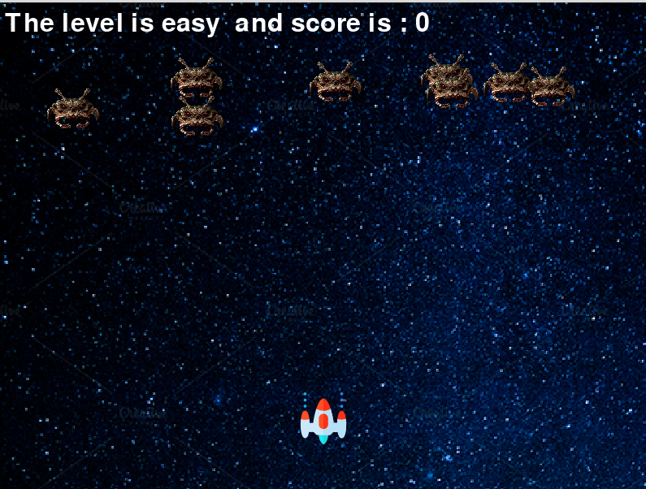

# Introduction
This is the repository hosting a space invaders game by Gibson and Conan

# GAME

# Installation and setup

Running the game uses pygame, which can be installed by running `$ pip install pygame`.
THe other required dependency is the `random` library.To install it run  `$ pip install random`

# File Structure
Our file structure consists of five major files and imagdise assets
* `mainClass.py` : This file runs the game
* `player.py`   :This file contains the player Class
* `score.py`    : This file contains the score Class 
* `spaceship.py`: This file contains the spaceship Class
* `enemy.py`    : This file contains the enemy Class
* assets      : This folder contains all the assets in the game

# Assets
ALl our assets were drawn from [flaticon](https://www.flaticon.com/)
